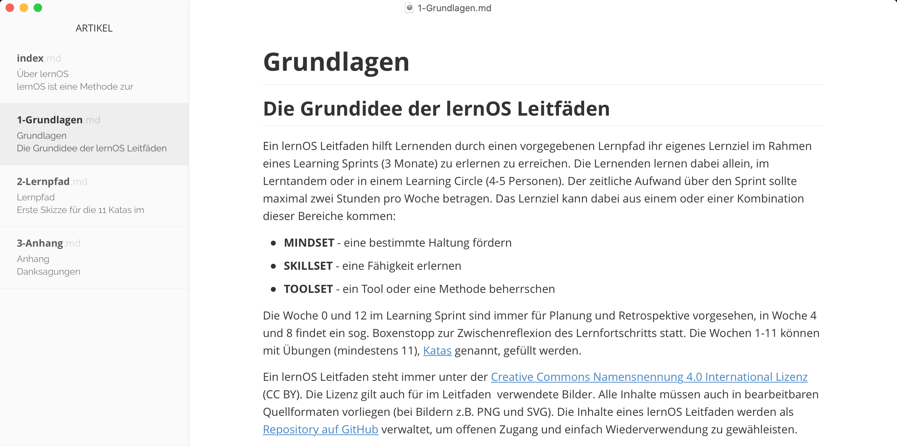
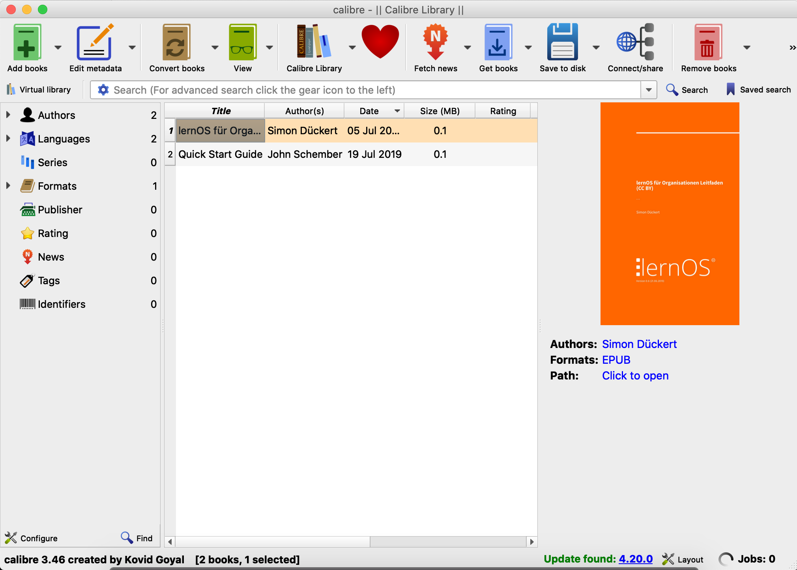

# Grundlagen
## Grundidee der lernOS Leitfäden

Ein lernOS Leitfaden hilft Lernenden durch einen vorgegebenen Lernpfad ihr eigenes Lernziel im Rahmen eines Learning Sprints (3 Monate) zu erlernen zu erreichen. Die Lernenden lernen dabei allein, im Lerntandem oder in einem Learning Circle (4-5 Personen). Der zeitliche Aufwand über den Sprint sollte maximal zwei Stunden pro Woche betragen. Das Lernziel kann dabei aus einem oder einer Kombination dieser Bereiche kommen:

* **MINDSET** - eine bestimmte Haltung entwickeln
* **SKILLSET** - eine Fähigkeit erlernen
* **TOOLSET** - ein Tool oder eine Methode beherrschen

Die Woche 0 und 12 im Learning Sprint sind immer für Planung und Retrospektive vorgesehen, in Woche 4 und 8 findet ein sog. Boxenstopp zur Zwischenreflexion des Lernfortschritts statt. Die Wochen 1-11 können mit Übungen (mindestens 11), [Katas](https://de.wikipedia.org/wiki/Kata_(Programmierung)) genannt, gefüllt werden. Eine Kata sollte einen Übenden zw. 30-60 Minuten Zeit kosten und auf nicht mehr als zwei DIN A4 Seiten beschrieben sein (Sushi-Card-Prinzip).

Ein lernOS Leitfaden steht immer unter der [Creative Commons Namensnennung 4.0 International Lizenz](https://creativecommons.org/licenses/by/4.0/deed.de) (CC BY). Die Lizenz gilt auch für im Leitfaden  verwendete Bilder. Alle Inhalte müssen auch in bearbeitbaren  Quellformaten vorliegen (bei Bildern z.B. PNG und SVG). Die Inhalte eines lernOS Leitfaden werden als [Repository auf GitHub](https://github.com) verwaltet, um offenen Zugang und einfach Wiederverwendung zu gewähleisten.


Dadurch können lernOS Inhalte für jeden Zweck offen zugegriffen, genutzt, verändert und geteilt werden (auch für kommerzielle Anwendungen). Produkte und Dienstleistungen dürfen allerdings nicht den Begriff "lernOS" im Namen tragen. Dieser Ansatz ist vergleichbar mit dem Browser [Chromium](https://de.wikipedia.org/wiki/Chromium_(Browser)) und den darauf aufsetzenden Produkten [Google Chrome](https://de.wikipedia.org/wiki/Google_Chrome), [Microsoft Edge](https://de.wikipedia.org/wiki/Microsoft_Edge), [Opera](https://de.wikipedia.org/wiki/Opera_(Browser)) und Brave.

## Lebenszyklus eines Leitfadens

Von der Idee bis zur Fertigstellung durchläuft ein lernOS Leitfaden verschiedene Phasen, die wir als [Lebenszyklus](https://de.wikipedia.org/wiki/Lebenszyklus) des Leitfadens bezeichnen. Auch wenn die Geschichte jedes Leitfadens anders verläuft, lassen sich grob folgende Phasen benennen:

* **Idee** - dine Einzelperson oder eine Gruppe von Personen hat die Idee für einen lernOS Lernpfad oder einen lernOS Leitfaden.
* **Zieldefinition** - die Idee konkretisierte sich, Lernziel und Zielgruppe der Lernenden werden klarer. Oft entstehen hier auch schon erste Inhalte z.B. in Form von Skizzen, Mitschriften, Mailverkehr etc.
* **Erstellung** - in dieser Phase werden Struktur und Inhalte erstellt. Lernpfade können in Formaten wie Word, als Google Doc oder PowerPoint entstehen, lernOS Leitfäden haben immer Markdown als Quellformat.
* **Veröffentlichung** - der Leitfaden wir als Repository auf GitHub veröffentlicht. Standardmäßig werden neben Markdown die Formate PDF, Word, HTML, und E-Book (EPUB, Mobipocket) produziert. Ist der Lernpfad eines Leitfaden noch nicht in der Praxis getestet, empfehlen wir 0.x Versionsnummer. Nach absolviertem Praxistest erhält der Leitfaden dann die Versionsnummer 1.0. Diese sollte dann mindestens in Deutsch und Englisch vorliegen, um internationale Nutzung zu ermöglichen.
* **Promotion** - der Leitfaden wird bekannt gemacht und Lernende zur Nutzung animiert (wichtig für die Erhebung von Feedback). Das kann z.B. über die lernOS Community-Plattform [CONNECT](https://community.cogneon.de), den lernOS Community Call und den Twitter-Account [@lern_os](https://twitter.com/lern_os) erfolgen.
* **Pflege** - in dieser Phase kümmert sich der Autor (Maintainer) - idealerweise mit einem Team von Mit-Autoren - um die Pflege des Leitfadens, den Ausbau der Inhalte und die Einarbeitung von Feedback. Wir empfehlen, Leitfäden in regelmäßigen Abständen zu aktualisieren und dadurch kontinuierlich zu verbessern (z.B. vierteljährlich oder halbjährlich). Für die Planung der Weiterentwicklung eignet sich ein Knaben-Board z.B. als [GitHub Projekt Board](https://docs.github.com/en/enterprise/2.15/user/articles/about-project-boards) oder [Trello Board](https://de.wikipedia.org/wiki/Trello).
* **Archivierung** - wenn der Leitfaden nicht weiter gepflegt wird und die Inhalte veraltet und nicht mehr nutzbar sind, werden die Inhalte archiviert, bleiben aber weiterhin verfügbar.

**Siehe auch:**

* Wiki-Seite [How to release a new guide version](https://github.com/cogneon/lernos-core/wiki/How-to-release-a-new-guide-version).
* Wiki-Seite [How to fork a lernOS Guide](https://github.com/cogneon/lernos-core/wiki/How-to-fork-a-lernOS-Guide).

## Inhaltsverzeichnis und Struktur

Zur einfachen Orientierung für die Lernenden haben alle lernOS Leitfäden die gleiche Grundstruktur ([Blog](https://cogneon.de/2019/04/30/wie-schreibt-man-einen-lernos-guide-einige-vorueberlegungen-zu-einer-anleitung/)). Diese besteht aus den vier Kapiteln Über lernOS, Grundlagen, Lernpfad und Anhang, die im Folgenden beschrieben werden.

### Kapitel "Über lernOS"

Das Kapitel "Über lernOS" erklärt die Grundlagen von lernOS (in allen Leitfäden gleich).

### Kapitel "Grundlagen"

Das Kapitel "Grundlagen" enthält theoretische Hintergründe und Informationen, die für das Verständnis des Leitfaden-Themas relevant sind. In diesem Kapitel wird viel auf andere verfügbare Quellen und Literatur verwiesen (Hub- oder Kurationsfunktion). 

### Kapitel "Lernpfad"

Das Kapitel "Lernpfad" enthält die Katas (Übungen) des Leitfadens. Jede Kata wird in einem eigenen Kapitel beschrieben, das maximal zwei Druckseiten lang sein sollte (Sushi-Card-Prinzip). Ein Leitfaden kann mehr als einen Lernpfad enthalten.

Wiki-Seite zur [Kata-Dokumentation](https://github.com/cogneon/lernos-core/wiki/How-to-write-a-lernOS-Guide).

### Kapitel "Anhang"

Das Kapitel Anhang enthält mindestens die "Änderungshistorie", oft auch ein Kapitel mit Danksagungen (z.B. um Beitragende zu nennen)

## Inhalte, Medien und Quellen

### Schreibstil

Damit lernOS Leitfäden möglichst [barrierefrei](https://de.wikipedia.org/wiki/Barrierefreiheit) nutzbar sind, sollte die Sprache so einfach verständlich wie möglich gehalten werden. Anglizismen und Fachbegriff sollten wo möglich vermieden werden. Verwende Fachbegriffe müssen immer in [Gemeinsprache](https://de.wikipedia.org/wiki/Gemeinsprache) erklärt werden. Fachbegriffe müssen wie im [lernOS Glossar](https://github.com/cogneon/lernos-core/blob/master/lernOS%20Glossary/de/lernOS-Glossary-de.md) definiert verwendet werden, um über alle lernOS Leitfäden eine einheitliche Begriffsverwendung zu gewährleisten. Werden in einem Leitfaden sehr viele Fachbegriffe eingeführt, empfiehlt sich ein Unterkapitel Glossar im Anhang des Leitfadens.

Im Kapitel Lernpfad wird eine direkte Ansprache der Lernenden mit "Du" verwendet, um zu aktivieren.

### Bilder

Ein Bild sagt mehr als 1000 Worte. Daher ist die Bebilderung von Leitfäden sehr sinnvoll. Auch bei Bildern sollten immer Quellen mit CC BY Lizenz verwendet werden. Vorzugsformat für Vektorgrafiken ist [SVG](https://de.wikipedia.org/wiki/Scalable_Vector_Graphics) (als PNG in den Leitfaden eingebunden), für Pixelgrafiken [PNG](https://de.wikipedia.org/wiki/Portable_Network_Graphics). Für die Erstellung und Bearbeitung von SVG-Vektor-Grafiken und den Export in PNG wird [Inkscape](https://inkscape.org) empfohlen, für Pixelgrafiken [Gimp](https://gimp.org).

### Audio und Video

Da die Produktionskette auch Textdokumente erzeugt, können in lernOS Leitfäden keine Audio- und Video-Inhalte eingebettet werden. Um trotzdem auf Audio- und Videoinhalte zu verweisen, können diese einfach im Text verlinkt werden.

### Markdown Syntax

Die Auszeichnungssprache Markdown lässt verschiedene Stile zu, die oft auch [Markdown Flavors](https://github.com/commonmark/commonmark-spec/wiki/markdown-flavors) genannt werden (z.B. kann man eine Aufzählung mit einem * oder einem - erzeugen). Für lernOS Leitfäden wird, wenn hier nicht anders beschrieben, die [Schreib- und Formatiersyntax von GitHub](https://docs.github.com/en/github/writing-on-github/basic-writing-and-formatting-syntax) verwendet. Für die Erstellung eines lernOS Leitfadens kommt man mit einer überschaubaren Anzahl von Markdown-Auszeichnungen aus:

**Überschriften:**

```
# Überschrift Ebene 1
## Überschrift Ebene 2
### Überschrift Ebene 3
```

**Fett und kursiv:**

```
**fett**
*kursiv*
```

**Liste (unnummeriert):**

```
- Listenpunkt 1
- Listenpunkt 2
```

Hinweis: Listen mit zwei Ebenen sind in Markdown möglich, werden aber von der Produktionskette nicht unterstützt.

**Liste (nummeriert):**

```
1. Listenpunkt 1
2. Listenpunkt 2
```

Hinweis: die Liste muss nicht korrekt durchnummeriert sein. Theoretisch kann jede Zeile der Liste mit 1. beginnen.

**Links:**

```
[Cogneon](https://cogneon.de)
```

Hinweis: Links werden in den produzierten Textdokumenten (z.B. PDF) zu Fußnoten.

**Bilder:**

```

```

Hinweis: der Pfad zum Bild ist im Markdown immer relativ zum Verzeichnis anzugeben, in dem die Markdown-Datei liegt (i.d.R. Unterverzeichnis *images*).

**Code und Syntax Highlighting:**

... folgt ...

**Tabellen:**

```
| Tables        | Are           | Cool  |
| ------------- |:-------------:| -----:|
| col 3 is      | right-aligned | $1600 |
| col 2 is      | centered      |   $12 |
| zebra stripes | are neat      |    $1 |
```

Hinweis: Tabellen sind in Markdown schwierig zu editieren und wo möglich zu vermeiden.

**Zitate:**

```
> Eine Investition in Wissen bringt immer noch die besten Zinsen.
> (Benjamin Franklin)
```

**Horizontale Linie:**

```
---
```

### Mehrsprachigkeit

lernOS Leitfäden sollten aus Gründen der Barrierefreiheit in möglichst vielen Sprachen vorliegen. Die Übersetzung von Leitfäden kann manuell, aber auch toolgestützt erfolgen. Hierfür wurden bereits folgende Tools verwendet:

* [Deepl](https://de.wikipedia.org/wiki/DeepL) - Online-Übersetzungsdienst
* [Microsoft Word](https://de.wikipedia.org/wiki/Microsoft_Word) - Online-Übersetzungsdienst als Teil von Office 365 (Überprüfen/Übersetzen/Dokument übersetzen)

## Leitfaden Produktionskette

lernOS Leitfäden werden in der Auszeichnungssprache [Markdown](https://de.wikipedia.org/wiki/Markdown) erstellt und i.d.R. auf [GitHub](https://de.wikipedia.org/wiki/GitHub) verwaltet. Aus den Markdown-Quellen werden über die lernOS Produktionskette weitere Zielformate wie PDF, Word, E-Book etc. generiert. Diese Generierung kann zentral auf GitHub (noch nicht verfügbar) oder auf dem eigenen Rechner erfolgen. Generiert man die Zieformate auf dem eigenen Rechner, ist ein Toolset notwendig, das im folgenden beschrieben wird. Wir versuchen wo möglich [Open Source Software](https://de.wikipedia.org/wiki/Open_Source) zu verwenden.

### lernOS Leitfaden Verzeichnisstruktur

Damit die lernOS Produktionskette funktioniert, müssen die Inhalte des Leitfadens in einem Dateiordner mit folgender Verzeichnisstruktur abgelegt werden (Beispiel für ein Leitfaden mit deutscher und englischer Version, fett sind Ordner- und Dateinamen, dahinter eine kurze Beschreibung):

* **de** - Inhalte der deutschen Version des Leitfadens

  * **src** - die Markdown-Quellen des Leitfaden
    * **css** - Anpassung von Farben für die Web-Version
    * **images** - Bilder des Leitfadens in den Formaten SVG und PNG
    * **1-Grundlagen.md** - das Kapitel "Grundlagen"
    * **2-Lernpfad.md** - das Kapitel "Lernpfad"
    * **3-Anhang.md** - das Kapitel "Anhang"
    * **index.md** - das Kapitel "Über lernOS", muss wegen Web-Version index.md heißen

  * **make.bat** - das Herzstück der Produktionskette, [Batch-Datei](https://de.wikipedia.org/wiki/BAT-Datei) (Windows), die alle Ergebnisdokumente produziert, im Datei-Explorer per Doppelklick ausführen. Hinweis: für Mac und Linux muss stattdessen eine Shell-Datei (make.sh) verwendet werden.
  * **metadata.yaml** - Metadaten für Pandoc (z.B. Titel, Untertitel, Autor(en), Version etc.)
  * **mkdocs.yaml** - Einstellungen für die Generierung der Web-Version mit mkdocs

* **docs**

  * **de** - deutsche Web-Version des Leitfadens
  * **en** - englische Web-Version des Leitfadens

* **en** - Inhalte der deutschen Version des Leitfadens

  * Struktur identisch mit der deutschen Sprachversion

**Hinweis:** im Verzeichnis einer Sprachversion liegen zusätzlich alle produzierten Dokumente (z.B. docx, epub, html, mobi, pdf).

**Hinweis:** Für die Benennung der Verzeichnisse für weitere Sprachversionen werden die Kürzel nach [ISO 639-1](https://de.wikipedia.org/wiki/Liste_der_ISO-639-1-Codes) verwendet.

**Hinweis:** Im src-Verzeichnis kann der Leitfaden auch auf Unterkapitelebene in einzelne Markdown-Dateien geteilt werden. Das ist z.B. sinnvoll, wenn mehrere Personen gleichzeitig an den Inhalten arbeiten oder die Inhalte in der Webversion auf Kapitelebene kommentierbar sein sollen. 

### lernOS Produktionskette auf Windows 10

Für die Erstellung der Zielformate aus den Markdown-Quellen wird ein sog. [Makefile](https://de.wikipedia.org/wiki/Makefile) verwendet (make.bat). Ist die Produktionskette auf dem eigenen Rechner richtig eingerichtet, führt ein Doppelklick auf dem Makefile (make.bat) dazu, dass alle Zielformate automatisch generiert werden. Je nach Umfang und Geschwindigkeit des eigenen Rechners kann das bis zu einigen Minuten dauern. Folgende Schritte werden in der Produktionskette ausgeführt:

1. Alte Versionen der produzierten Dokumente löschen.
2. Word-Version (.docx) produzieren
3. HTML-Version (.html) produzieren (rohes HTML, z.B. für Copy&Paste in CMS oder ESN)
4. Web-Version produzieren (mkdocs mit Theme [material](https://squidfunk.github.io/mkdocs-material/), Ergebnis im Ordner docs)
5. PDF-Version produzieren (.pdf)
6. Titelseite als Grafik aus PDF exportieren (src/images/ebook-cover.jpg)
7. E-Book-Version EPUB (.epub) produzieren
8. E-Book-Version EPUB (.epub) on Mobipocket (.mobi) konvertieren
9. Fertig :-)

### Ideen für die Erweiterung der lernOS Produktionskette

Wie auch die Leitfäden wird die lernOS Produktionskette kontinuierlich erweitert. Einige Ideen für die Erweiterung:

* **Github Actions:** aktuell ist eine automatisierte Produktionskette mit [GitHub Actions](https://github.com/features/actions) in Vorbereitung.
* **OneNote:** zusätzlich Produktion einer OneNote-Version der Leitfäden (aktuell nur als Begleitdokument, das manuell gepflegt werden muss).
* **Audiobook:** Produktion eines Audiobooks mit Kapitelmarken zum Anhören (z.B. mit [Balbolka](http://www.cross-plus-a.com/balabolka.htm)).

## Toolset für die Produktionskette

Für die lernOS Produktionskette sind einige Tools auf dem eigenen Rechner oder in der Cloud erforderlich. 

### Typora

[Typora](https://typora.io/) ist ein Text-Editor zur Bearbeitung von [Markdown](https://en.wikipedia.org/wiki/Markdown)-Inhalten. Typora ist für lernOS Inhalte der empfohlene Markdown-Editor, weil er plattformübergreifend verfügbar ist und Markdown als echtes WYSIWYG (What You See Is What You Get) anzeigt. Markdown kann man prinzipiell auch mit einfachen Texteditoren erstellen und bearbeiten, gerade für Einsteiger ist die WYSIWYG-Ansicht aber von Vorteil.



### Pandoc

[Pandoc](https://pandoc.org) ist ein Komandozeilen-basierter Text-Konverter, der Markdown in andere Formate konvertieren kann. Beispiel für die Konvertierung von Markdown in Microsoft Word:

```
pandoc dokument.md -o dokument.docx
```

Zu den von Pandoc unterstützten Formaten gehören u.a.:

* Asciidoc
* DokuWiki
* EPUB (E-Book)
* HTML
* LaTeX
* Markdown
* MediaWiki
* Microsoft PowerPoint
* Microsoft Word (docx)
* OpenOffice/LibreOffice (odt)
* Reveal.js (Online-Präsentationen)
* Textile (z.B. für Confluence)
* uvm.

### GitHub Desktop

[Github Desktop](https://desktop.github.com) ist ein Client, der [GitHub](https://de.wikipedia.org/wiki/GitHub) Repositories mit dem lokalen Rechner synchronisieren kann. Somit kann z.B. lokal an Markdown-Inhalten gearbeitet und diese bei Bedarf ins Repository synchronisiert werden. Die Funktionsweise kann man sich ähnlich wie die Synchronisation von Dateien mit Dropbox oder OneDrive vorstellen.


### LaTeX & Co.

[LaTeX](https://de.wikipedia.org/wiki/LaTeX) ist ein Programmpaket, um im TeX-Format geschriebene Textdokumente in Formate wie HTML oder PDF zu konvertieren. In der lernOS Produktionskette wird wird eine LaTeX-Distribution (unter Windows [MiKTeX](https://miktex.org)) verwendet, um mit pandoc direkt PDF-Dateien generieren zu können. Hierfür ist zusätzlich [Ghostscript](https://de.wikipedia.org/wiki/Ghostscript) notwendig.

Als Vorlage für die PDF-Erstellung der lernOS Leitfäden wird das pandoc LaTex Template [Eisvogel](https://github.com/Wandmalfarbe/pandoc-latex-template) verwendet und über die Datei *metadata.yaml* angepasst. Für den Einsatz dieser Vorlage werden bei erstmaligen Verwendung weitere LaTeX-Erweiterungen installiert.

### MkDocs & Material for MkDocs

[MkDocs](https://www.mkdocs.org/) ist statischer Webseiten Generator, der die responsive Webversion mit Navigation, Suche, Social Links und Kommentarfunktion erzeugt. Als Theme kommt bei der Web-Version der lernOS Leitfäden [Material for MkDocs](https://squidfunk.github.io/mkdocs-material/) zum Einsatz.


Für die Kommentarfunktion am Ende jeder Seite der Web-Version kommt der Dienst [Disqus](https://de.wikipedia.org/wiki/Disqus) zum Einsatz:


### Calibre

[Calibre](https://calibre-ebook.com) ist eine E-Book-Management-Software, die für die Konvertierung der E-Book-Version [EPUB](https://de.wikipedia.org/wiki/EPUB) in [Mobipocket](https://de.wikipedia.org/wiki/Mobipocket) (mobi, z.B. für Kindle Reader und Kindle App) zu erzeugen. Um aus der PDF-Version eines Leitfadens das Titelbild als Grafik zu extrahieren und in die richtige Größe für E-Books zu skalieren kommt das Grafik-Paket [ImageMagick](https://www.imagemagick.org) zum Einsatz.



