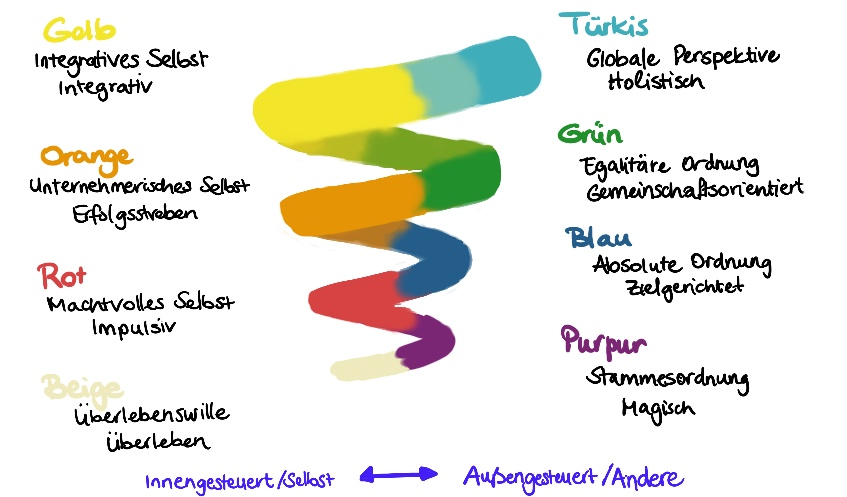

## Woche 6: Wie sieht die (Organisations) Landschaft aus?

Nachdem du dich letzte Woche mit deinen Vorbildern beschäftigt hast, schaust du diese Woche aus der Metaperspektive auf dich, dein Team, dein Unternehmen und auf dein Ziel. Stell dir vor, du stehst auf einem Berg und blickst auf die Organisationslandschaft herunter.

Immer wieder werden Vorstellungen an uns herangetragen, was „gute Führung" bedeutet, welche Leadership-Kompetenzen jetzt angesagt sind, wohin sich Unternehmen heutzutage entwickeln müssen.

In dieser Woche geht es darum,

- weg von den Idealen hin zu einem besseren Verständnis der Organisationskultur zu kommen.

- die Metaperspektive einzunehmen. Wie sieht die Realität in deinem Unternehmen aus? Welche Werte prägen die Unternehmenskultur? Wie ticken deine Mitarbeiter? Was ist dir als Führungskraft oder in deiner Leadership-Rolle wichtig?

- dich aus dem Abstand heraus zu fragen, vor welchen Herausforderungen du in der Praxis stehst und was das für dein lernOS-Ziel heißt.

**Als Vorbereitung**

- Kata 6.1: Spiral Dynamics -- dein Blick auf die Organisation

- Wenn Du Lust hast, thematisch noch tiefer einzusteigen: Kata 6.2 (Blick auf dich und dein Team) bzw. Kata 6.3 (Blick auf dein Ziel)

**Im Weekly**

- Check-in (10 min)

> Wir sind oft sehr gut darin „Schwächen" oder „Entwicklungsbedarfe" zu identifizieren. Beim heutigen Check-in starten wir mit einem bewussten Blick auf die Stärken. Beantworte für dich selbst oder innerhalb deines Circles die folgenden Fragen:
> 
> Was schätzt du an deinem Unternehmen?
> 
> Was schätzt du besonders an deinen Mitarbeiter:innen?
> 
> Was schätzt du an dir als Führungskraft? -- Berichte kurz, wo du in der letzten Woche eine deiner Stärken als Führungskraft / in deiner Rolle als Leader einsetzen konntest.

- Reflexion und Austausch (40 min)

> Mach dir/macht euch die Unterschiede zwischen den für euch relevanten Ebenen des Modells durch Praxisbeispiele bewusst. Wo ordnest du dich ein? Wo siehst du deine Organisation? Und entsteht daraus ein Spannungsfeld und/oder ein Führungsdilemma?

- Check out (10 min)

Die kommende Woche ist eine gute Woche zum Nachdenken. Du hast heute Möglichkeiten praktiziert, aus der Metaperspektive auf dich, dein Team, dein Unternehmen und auf dein Ziel zu schauen. Lass es wirken.

Was war heute deine wichtigste Erkenntnis? Gab es einen Aha-Moment?

*Hinweis und Ausblick:*

Es ist prima, wenn du durch die heutige Reflexion in deiner Zielstellung bestärkt wurdest. Genauso hilfreich ist es aber auch, wenn du ins Nachdenken gekommen bist, ob es notwendig ist, dein Ziel anzupassen und zu schärfen, oder wenn du dir über mögliche Hindernisse bewusst geworden bist, die deiner Zielstellung im Weg stehen. Mit diesen Erkenntnissen bist du gut vorbereitet für die nächste Woche, denn deine Lernreise geht weiter mit der Frage: Wie kommst du deinem Ziel näher?

# Kata-Log

## Kata 6.1: Spiral Dynamics -- dein Blick auf die Organisation

Im Folgenden siehst du ein intuitiv erfassbares und doch komplexes Entwicklungsmodell für Menschen, Teams und Organisationen. Es basiert auf den Forschungsarbeiten von Clare Graves. Von Don E. Beck und Christopher C. Cowan wurde es anwenderfreundlicher formuliert und dadurch auch über akademische Kreise hinaus bekannt gemacht.

Mach dich mit den 8 Ebenen der Entwicklung vertraut. Nutz für einen Überblick sowohl die Grafik als auch die Tabelle. Bei diesem Überblick geht es nicht darum, das Modell im Detail zu verstehen. Wichtiger ist es, auf das Folgende zu achten: Mit welcher Ebene / welchen Ebenen gehst du in Resonanz, d. h. worauf und wie (positiv, negativ ...) reagierst du?

**Ein Entwicklungsmodell für Menschen, Teams und Organisationen**

Grafik erstellt von Marianne Windelband und Johanna Zimmermann in Anlehnung an Don E. Beck und Christopher C. Cowan und auf Basis von Clare C. Graves

**Erläuterungen zum Modell:**

- Menschen, Teams und Organisationen lassen sich nie nur auf eine Entwicklungsstufe reduzieren. In jeder Entwicklungsstufe sind alle Aspekte der vorherigen Entwicklungsstufen vorhanden.

- Die Zuordnung muss dabei nicht eindeutig sein. Beispielsweise kann man immer wieder beobachten, dass die proklamierten Werte einer Organisation einer anderen Entwicklungsstufe zugeordnet werden können als die (noch) gelebten Praktiken.

- Auf den Ebenen 1-6 fällt es Menschen schwer die anderen Stufen respektvoll zusehen und anzuerkennen, erst ab Ebene 7 (Gelb) ist das Verständnis da, dass alle Stufen ihre Berechtigung haben.

**Spiral Dynamics: Eine nähere Betrachtung der ersten 7 Entwicklungsstufen**

Tabelle basierend auf Don E. Beck, Christopher C. Cowan: Spiral Dynamics, 9te Auflage 2020, Zusammenstellung M. Windelband

Quellen und interessante Links:

- Don E. Beck, Christopher C. Cowan: Spiral Dynamics - Leadership, Werte und Wandel - eine Landkarte für Business, Politik und Gesellschaft im 21. Jahrhundert, 9te Auflage 2020

- [Clare W. Graves homepage](http://www.clarewgraves.com/)

Wer Inspiration sucht auf dem Weg zur "evolutionären Organisation":

Frederic Laloux, Reinventing Organisations, München, 2017, Verlag Franz Vahlen.

## Kata 6.2: Spiral Dynamics -- dein Blick auf dich und dein Team

Nutz gerne das Modell Spiral Dynamics, um mal einen anderen Blick auf dich und dein Team zu werfen. Folgende Fragen können deine Reflexion (und euren Austausch) lenken.

- Reflexion und Austausch

> Überleg für dich und tauscht euch untereinander aus: Wo siehst du dich selbst, wo dein Team, wo deine Organisation?
> 
> Dazu hier einige Fragen zur Anregung:
> 
> Du in deiner Führungsrolle
> 
> Auf welcher Ebene bewegst du dich vorwiegend, z. B. weil es deine Aufgabe, dein Umfeld erfordert?
> 
> Gibt es einen Unterschied zwischen deinen Werten und Führungsidealen und deinem Handeln?
> 
> Gibt es eine andere Ebene, auf die du je nach Kontext springst oder z. B. auch in Stresssituationen zurückfällst?
> 
> Dein Team (Mitarbeiter:innen bzw. deine Peer-Group / deine Arbeitsgruppe / die Kolleg:innen)
> 
> Auf welchen Ebenen befinden sich deine Mitarbeiter:innen?
> 
> Gibt es Unterschiede zwischen einzelnen Mitarbeiter:innen?
> 
> Passt du dein Führungsverhalten an dein Gegenüber oder auch je nach Situation an?
> 
> Dein Unternehmen (bzw. die Organisation)
> 
> Welcher Entwicklungsstufe würdest du die Organisation / das Unternehmen, für das du arbeitest, zuordnen?
> 
> Welche Widersprüchlichkeiten erlebst du in der Organisation, z. B. zwischen den Unternehmenswerten und der Praxis oder zwischen Organisationseinheiten?
> 
> Zielt man im Unternehmen eher auf eine Verbesserung innerhalb der bestehenden Entwicklungsstufe oder gilt es eine neue Ebene zu erreichen?

## Kata 6.3: Spiral Dynamics -- ein Blick auf dein Ziel

Das Modell Spiral Dynamics kann auch helfen, eine andere Perspektive auf dein Ziel zu bekommen. Nutze dafür gerne folgende Reflexionsfragen. Ein Austausch kann dir helfen noch tiefer einzutauchen.

- Reflexion und Austausch

> Nachdem du dich selbst, dein Team, deine Organisation reflektiert hast, betrachte nun dein lernOS-Ziel nochmal neu: Stell dir selbst die folgenden Fragen und tauscht euch untereinander über die folgenden beiden Fragen aus:
> 
> Frage 1: Wozu leistet dein lernOS-Ziel einen Beitrag?
> 
> Bringt es dich, dein Team oder die Organisation innerhalb der bestehenden Entwicklungsstufe voran?
> 
> Oder dient es der Weiterentwicklung hin zu einer neuen Ebene?
> 
> Oder gilt es, nochmal auf einer vorhergehenden Entwicklungsstufe anzusetzen? (z.B. wenn es um Teambuilding geht: „Das Nest des Stammes warmhalten")
> 
> *Hinweis:*
> 
> Mach dir bewusst, es geht bei der eigenen Zielsetzung nicht um „höher, schneller, weiter", sondern um das, was jetzt wichtig ist -- mit deinem Ziel da anzusetzen, wo du, dein Team, deine Organisation stehen.
> 
> Frage 2: Vor welchen Herausforderungen stehst du in der Praxis und was bedeutet das für dein Ziel?
> 
> Hier einige Fragen zur Anregung:
> 
> Bist du durch die heutige Reflexion in deiner Zielstellung bestärkt worden?
> 
> Bist du durch die heutige Reflexion zu einer Zielschärfung angeregt worden?
> 
> Bist du durch die heutige Reflexion auf Hindernisse -- bei dir selbst/auf Teamebene/auf der Organisationsebene - aufmerksam geworden, die deiner Zielstellung im Weg stehen?
> 
> Was kann dir helfen, absehbare Hindernisse und Blockaden zu überwinden? Gibt es jetzt konkret etwas, das du angehen kannst? Oder reicht es dir, wenn du mögliche Hindernisse und Blockaden in den nächsten Wochen im Rahmen deiner Lernreise nochmal anschaust -- z. B. im Rahmen einer kollegialen Fallberatung mit der Methode "Wise Crowds" (siehe Kata 9.2: Wise Crowds (Liberating Structures).
