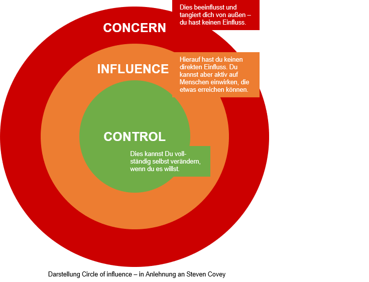

## Woche 7: Entdecke, was in deiner Macht liegt

Auch in dieser Woche fokussierst du dich auf deine Führungsrolle. In Woche fünf hast du die Dinge in den Blick genommen, die dir wichtig sind: Vorbilder zur Orientierung, deine Grundsätze und/oder deine Gebrauchsanweisung. In der letzten Woche hast du aus der Metaperspektive auf die Organisationskultur geschaut und dabei vermutlich auch kleine und größere Blockaden, Hürden und Hindernisse entdeckt, die dich als Führungskraft und in Bezug auf deine Ziele in ein Dilemma bringen. In dieser Woche geht es darum, einen Weg zu finden, mit diesen Hürden und Hindernissen umzugehen.

**Als Vorbereitung**

- Kata 7.1: Circle of Influence

- Wenn Du Lust hast, thematisch noch tiefer einzusteigen: Kata 7.2 (Reflexionsfragen zum Circle of Influence) und/oder 7.3 (Dank & Wertschätzung)

**Im Weekly**

- Check-in: (10 min)

> Wie ging es dir bei der Wahrnehmung des „Führungsdilemmas", das du in der letzten Woche identifiziert hast?
> 
> Erinnere dich noch einmal an all deine Reaktionen - auf der kognitiven, der emotionalen und auch auf der körperlichen Ebene. Welche Gedanken, Gefühle, Körperreaktionen sind dir aufgefallen: Was hast du gedacht, gefühlt, gespürt?
> 
> Teile diese Reaktionen im Circle oder schreib sie dir jetzt auf.
> 
> *Hinweis:*
> 
> Es ist wichtig, deine Führungsdilemmata einschließlich deiner Reaktionen zu kennen. Das versetzt dich in die Lage diese loszulassen, um dann vorwärtsdenken zu können.

- Austausch über Kata 7.1: Circle of Influence (45 min)

> Tauscht Euch zunächst kurz auf der Metaebene dazu aus, wie ihr bei der Kata vorgegangen seid. Hast du dich strukturiert von außen nach innen vorgearbeitet oder umgekehrt? Oder hast du erst deine Punkte gesammelt und sie dann den einzelnen Kreisen zugeordnet? Wie leicht oder schwer sind dir Sammlung und Zuordnung gefallen? Wie ging es dir mit dem Modell?
> 
> Nehmt euch dann Zeit und teilt einzelne Punkte aus eurem „Circle of Influence". Das können die Punkte sein, die dir besonders wichtig sind; die, die gerade noch viel Aufmerksamkeit verschlingen; die, deren Zuordnung dir schwergefallen ist; oder die, die dich überrascht bzw. gefreut haben.
> 
> Anschließend widmet ihr euch dem „Ins-tun-kommen". Überlege für die Bereiche Control & Influence: Was sind erste konkrete Schritte? Nimm dir aus dem Bereich Control zwei oder drei Dinge vor, die du in den nächsten 72 Stunden umgesetzt haben willst. Teile diese im Circle.
> Tipp: Für diese Aufgabe könnte die Kata 7.2 spannende Reflexionsfragen bieten.
> 
> Wenn du den Guide allein durchläufst: Wähl eine Vertrauensperson, der du innerhalb der nächsten 24 Stunden von deinen Überlegungen erzählst. Bereite deinen Kurzreport wie oben beschrieben vor.
> 
> Diskutiert abschließend noch folgenden Gedanken:
> 
> Manchmal verorten wir Ereignisse vorschnell im Bereich „Concern": Eine Situation macht uns betroffen, sie beschäftigt uns gedanklich und bindet sowohl Aufmerksamkeit als auch Energie. Wir glauben, wir sind in der Situation ohnmächtig -- ohne Macht. Manchmal können wir die Situation jedoch mit Hilfe anderer, auf die wir Einfluss nehmen können, verändern.
> 
> Wo hat sich in deinem Bereich „Concern" vielleicht ein Punkt versteckt, den du mit Unterstützung deines Circles oder deiner Vertrauensperson noch einmal neu bewerten kannst?

- Check-out (5 min)

> Nimm dir bitte kurz Zeit zum Innehalten. Bitte vervollständige den folgenden Satz: „Wenn ich aus meiner Führungsrolle auf meine Fähigkeit schaue, Dank & Wertschätzung zu zeigen, dann ..."
> 
> PS: Du willst wissen, was dieser Check-out mit dem Circle of Influence zu tun hat? Dann riskier doch einen kurzen Blick in die Kata 7.3 ...

# Kata-Log

## Kata 7.1: Circle of Influence

Das Modell „Circle of Influence" von Stephen R. Covey kann uns helfen zu analysieren, welche Angelegenheiten wir beeinflussen können und welche nicht. Es unterstützt uns, noch besser, strukturierter und gezielter unsere Handlungsfähigkeit zu entwickeln.

Stephen R. Covey hat das Modell mit seinem Bestseller „Die 7 Wege zur Effektivität" populär gemacht. In Anlehnung an Covey stellen wir euch heute ein erweitertes Modell vor, bestehend aus drei Kreisen:

Der innere, kleinere Kreis, der sogenannte "**Circle of Control**", beschreibt unseren unmittelbaren Einflussbereich -- also all die Dinge, die wir direkt, eigenverantwortlich und proaktiv selbst beeinflussen und gestalten können. Im Mittelpunkt stehen unsere Kompetenzen und Ressourcen. Hier sagen wir: „Ich kann ..."

In dem erweiterten Kreis, dem „**Circle of Influence**" liegen jene Dinge, für die wir (auch) die Unterstützung anderer brauchen. Im Mittelpunkt stehen unser Netzwerk sowie unsere Fähigkeit, andere zu motivieren und um Unterstützung zu bitten. Hier sagen wir: „Ich kann mit Hilfe anderer ..."

Im äußeren Kreis, dem "**Circle of Concern**" befinden sich all die Dinge, die uns beeinflussen, die sich jedoch unserer Kontrolle entziehen. Hier sagen wir oft „MAN müsste, sollte, hätte ..." Viel besser wäre es hier zu sagen: „Ich kann es nicht ändern ..." Also gilt es: Die Dinge anzunehmen, so wie sie sind, sie zu akzeptieren, loszulassen.

Wie gestaltet sich, bezogen auf dein Leadership-Ziel, gerade dein „Circle of Influence"? Womit beschäftigst du dich gerade? Was liegt in deinen Bereichen „Control", „Influence" und „Concern"? Schreib mindestens 10 Aspekte auf und ordne sie den drei Kreisen zu.

Gelingt es uns, unseren Fokus auf das Beeinflussbare zu lenken, fließt dorthin auch unsere Energie getreu dem Motto „Die Energie folgt der Aufmerksamkeit" bzw. „Where the focus goes, energy flows." (Tony Robbins)

Wenn wir viel Aufmerksamkeit in den Bereich „Concern" investieren, steigt unser Stressempfinden. Wir verfallen in eine Opferhaltung und einen reaktiven Modus. Unsere Sorgen und Ängste lähmen uns. Dabei übersehen wir die Dinge, die wir selbst beeinflussen können. Unser Einflussbereich schrumpft und wir werden unzufrieden.

Im proaktiven Modus konzentrieren wir unsere Energie auf die Bereiche „Control" und „Influence" und damit auf unseren Einflussbereich. Wir fokussieren uns auf die Dinge, die wir in der Hand haben. Dadurch wächst der Bereich unseres Lebens, den wir selbstbestimmt gestalten können.

Stephen R. Covey formuliert es so: „I am not a product of my circumstances. I am a product of my decisions."

Quelle:

Stephen R. Covey: Die 7 Wege zur Effektivität. Prinzipien für persönlichen und beruflichen Erfolg. GABAL Verlag GmbH, Offenbach, 2005, S. 94ff

## Kata 7.2: (D)Eine Circle-Reflexion

Um die einzelnen Ebenen des Circle of Influence genauer zu beleuchten, helfen dir vielleicht folgende Reflexionsfragen. Pick dir die wertvollsten Fragen raus.

> **Control:**
> 
> Was kann ich selbst tun? Wie kann ich selbst gestalten?
> 
> Welche Informationen kann ich mir selbst beschaffen?
> 
> Was kann ich zur Erreichung meines eigenen Ziels beitragen?
> 
> Wie sorge ich dafür, dass sich eine Situation verändert?
> 
> Mit welchen Maßnahmen kann ich ein Thema treiben, das mir wichtig ist?
> 
> **Influence:**
> 
> Wen kann ich um Unterstützung/Hilfe bitten?
> 
> Wer entscheidet über meine aktuellen Anliegen? Wer hat Zugang oder Einfluss auf diese Entscheider:innen?
> 
> Wie kann ich diese Personen erreichen und auf welche Weise aktivieren?
> Wo kann ich diesen Personen begegnen?
> 
> Wer kann mir dabei helfen, diese Personen zu identifizieren?
> 
> Wer kann mein Thema pushen/mich von meinen Sorgen entlasten/mich unterstützen?
> 
> Von wem und auf welchem Weg erhalte ich Feedback zu meinen Anliegen, Gedanken und Empfindungen? 
> 
> **Concern:**
> 
> Welche Möglichkeiten sehe ich, unter diesen Bedingungen weiterzuarbeiten bzw. zu leben?
> 
> Wie kann ich mich mit den Gegebenheiten arrangieren, ohne mich zu verbiegen?
> 
> Wer kann mich bei der Suche nach Akzeptanz oder alternativen Lösungen unterstützen?
> 
> Was wäre, wenn ich die jetzige Situation mit einem Blick aus der Zukunft, z. B. in drei Jahren, betrachtete? Was hätte ich dann möglicherweise gelernt?
> 
> Was verbirgt sich hinter meinem derzeitigen Widerstand? Was würde passieren, wenn ich diesen überwinden würde? Wie kann ich die dahinter liegenden Bedürfnisse und Wünsche noch leben?
> 
> Die Reflexionsfragen sind inspiriert von folgenden Beiträgen:
> 
> <https://montags-impulse.de/2021/03/22/circle-of-influence/>
> 
> <https://www.businessvillage.de/Circle-of-Influence-Das-effektive-Tool-fuer-den-Neustart/mag-1954.html>

## Kata 7.3: Dank und Wertschätzung

Die Neigung, das Negative (wie den Bereich „Concern") stärker wahrzunehmen als das Positive (wie die Bereiche „Influence" und „Control"), ist wissenschaftlich gut untersucht und scheint tief in unserer menschlichen Natur verwurzelt zu sein. Sie zu überwinden gelingt mit Aufmerksamkeit und durch Übung.

In seinen Büchern „Management 3.0" und „Management for Happiness" stellt Jürgen Appelo die Arbeit mit Kudo-Karten vor. Kudos stammt vom griechischen (Hinweis Simon: Sonderzeichen führte zu Fehler, prüfen) (kydos), was so viel wie Anerkennung, Ruhm, Ehre heißt. Die Kudo-Karten geben einem Team die Möglichkeit, einander hierarchieunabhängig und zwanglos gegenseitig Wertschätzung entgegenzubringen -- und das in schriftlicher Form.

Sag mittels einer Kudo-Karte einfach mal Danke. Hast du keine zur Hand, tut es auch eine Postkarte oder eine schlichte Haftnotiz, der Inhalt zählt.

Wähl eine Kudo-Karte und schreib sie für einen Member deines Circles bzw. für deine Vertrauensperson. Vielleicht wollt ihr zur besseren Organisation auch „Namen ziehen" lassen. Lest einander eure Karten vor und/oder sendet euch einander die Karten im Anschluss an die Session zu.

Hier findest du die Karten zum Download und/oder Ausdrucken:

- [https://www.cocondi.de/wp-content/uploads/2018/10/M30_Kudo-Cards-2018-Deutsch.pdf](https://www.cocondi.de/wp-content/uploads/2018/10/M30_Kudo-Cards-2018-Deutsch.pdf)

Idee: Stell die Karten doch auch deinem Team vor und zur Verfügung.

Weiterführende Links:

- <https://management30.com/practice/kudo-cards/>

- <https://www.agilewh.de/wp-content/uploads/2014/09/Management-3.0-Workout-Design-Edition-B.-Kudo-Box-and-Kudo-Cards-1.pdf>

- [https://agilestrides.com/blog/implementing-kudo-cards/](https://agilestrides.com/blog/implementing-kudo-cards/)

- [https://vitaminp.info/einfach-mal-danke-sagen-mit-kudo-karten/](https://vitaminp.info/einfach-mal-danke-sagen-mit-kudo-karten/)

- <https://lobkaertchen.de>

